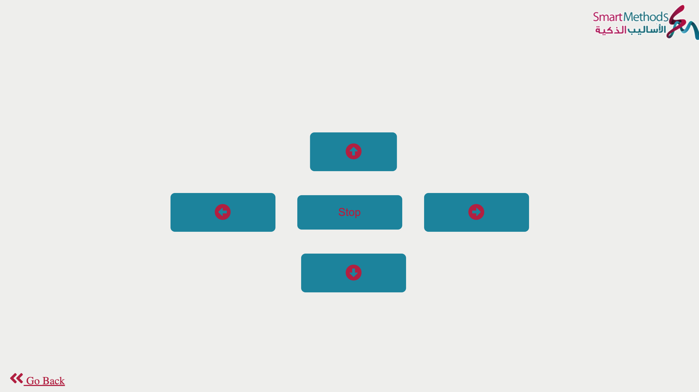
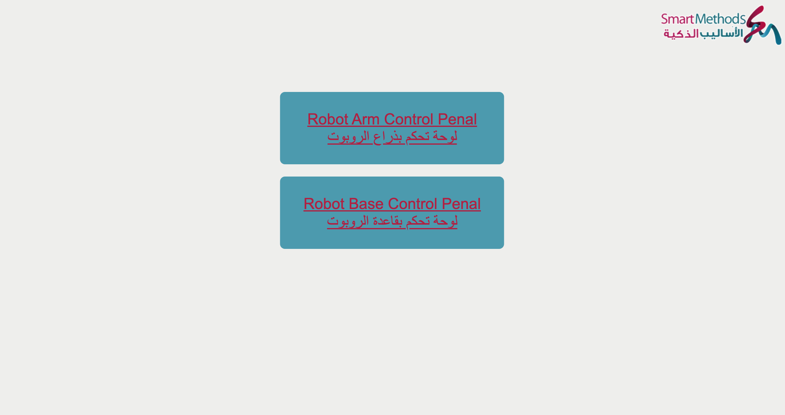
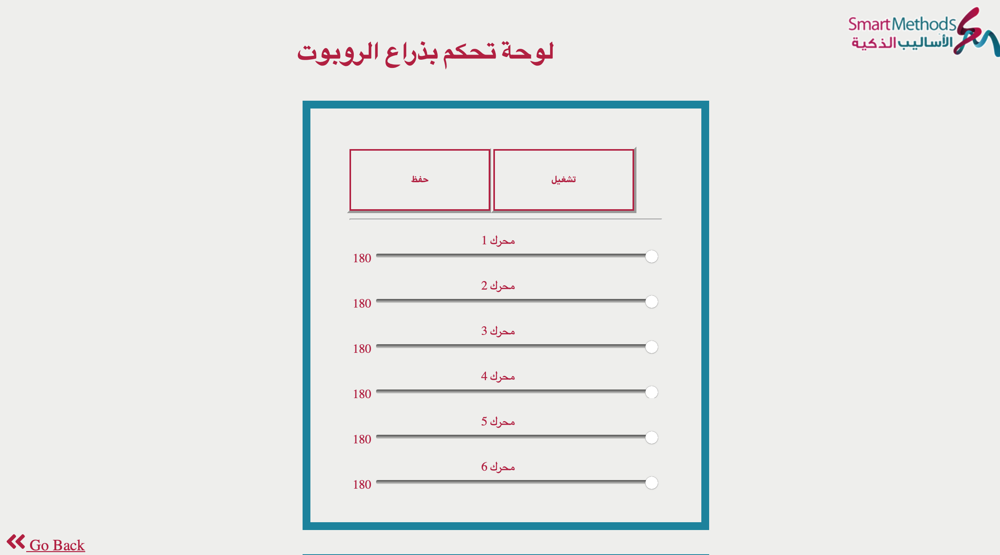

# Task2-RobotBaseControl
This task is a part of the summer training at the Smart Methods Company.
--------------------------------------
This task contains 6 sub-tasks:
--------------------------------
1. designing the control interface to move the robot base, 
2. creating a robot base control database, 
3. linking the database to the control interface, 
4. creating PHP pages to link the database to the device (the base),
5. merging the arm control panel with the robot base control panel in one interface, 
6. display the interface as a mobile web view. 

-------------------------------------
This repository contains:
--------------------------
1. HTML page >> contains the control base interface,(baseControl.html)
2. CSS page >> contains the design of the control base interface,(baseControlStyle.css)
3. 2 pages of PHP>> **connRobotBase.php** : contains the code to connect the database with the interface, **retrievalBase.php** : contains the code to connect the database with the hardware that retrieves the directions of robot base.
4. SQL : DB contains 1 table for the robot base directions.
5. HTML page >> contains the both tasks in singl page. (index.html)
6. Task 1 files >> interface: robotArm.html , design:robotArmStyle.css and PHP pages (conn.php, dataRetrieval.php).
---------------------------------
The task interfaces
---------------------------------

---------------------------------
هذه المهمة هي جزء من التدريب الصيفي في شركة الأساليب الذكية.
--------------------------------
تحتوي هذه المهمة على 6 مهام فرعية
--------------------------------
1. تصميم واجهة التحكم لتحريك قاعدة الروبوت ،
2. إنشاء قاعدة بيانات تحكم لقاعدة الروبوت ،
3. ربط قاعدة البيانات بواجهة التحكم ،
4. إنشاء صفحات PHP لربط قاعدة البيانات بالجهاز (القاعدة) ،
5. دمج لوحة تحكم الذراع مع لوحة تحكم قاعدة الروبوت في واجهة واحدة ،
6. عرض الواجهة كعرض ويب للجوال.
-----------------------------------
يحتوي هذا المستودع على
-----------------------------------
1. صفحة HTML >> تحتوي على واجهة قاعدة التحكم ،
2. صفحة CSS >> تحتوي على تصميم واجهة قاعدة التحكم ،
3. صفحتان من PHP >> **connRobotBase.php:** تحتوي على كود لربط قاعدة البيانات بالواجهة ، 
**RetretevalBase.php:** تحتوي على كود لربط قاعدة البيانات بالأجهزة التي تسترجع اتجاهات قاعدة الروبوت.
4. SQL: DB يحتوي على جدول واحد لاتجاهات قاعدة الروبوت.
5. صفحة HTML >> تحتوي على كلا المهمتين في صفحة واحدة.
6. ملفات المهام 1 >> 
 واجهة: robotArm.html   ، التصميم: robotArmStyle.css ,وصفحات PHP.
